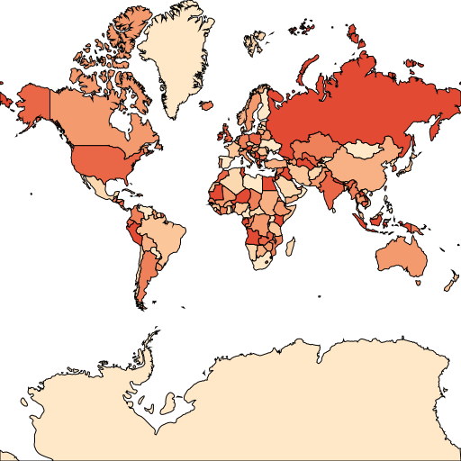
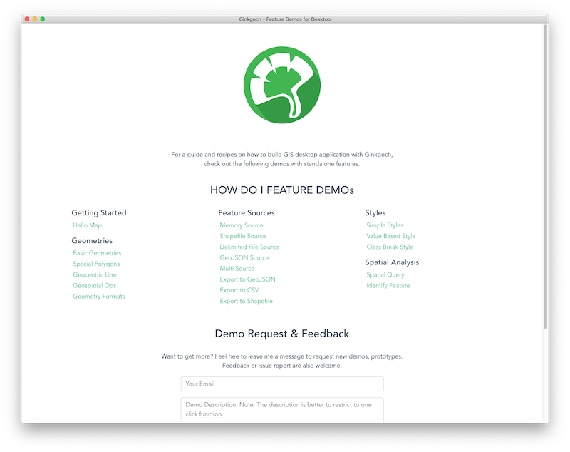

# Ginkgoch Map for Node.js
`Ginkgoch MAP` is GIS Full-Stack Solution with JavaScript. It is a development library for building map visualization, data analysis on web service/application, desktop and mobile. It is not necessary to learn the other programming languages, but build your maps with JavaScript only.

## Overview
1. Full-stack GIS (backend/frontend) development with JavaScript only - Learn one programming language and develope full-stack GIS solutions.
2. Visualization/Data analysis - A complete development framework with visualization libraries, data APIs.
3. Rapid APP development - Compatible with HTML5 layouts as well as many fantastic mapping client library to build responsive application prototypes with your own GIS data.
4. Performance and interactivity - Smoothly visualize millions of geometries on server and compatible with 3rd party client mapping libraries.
5. Scalability - Scale your apps to millions of requests with Ginkgoch-Server as a backend. In-app cluster is also supported.
6. Cross-platform - Web service, Desktop or Mobile; macOS, Linux or Windows; no native APIs.

## Features
1. Geometry and Spatial Analysis.
2. Thematic Styles.
3. Various data format (SHP, CSV, MEM, GeoJSON etc.) read and write support.
4. Map with multiple layers overlap.

## Getting Started
Here is a project to represents basic functions of Ginkgoch and build a very simple XYZ map tile service with KOA with your own data. https://github.com/ginkgoch/map-quick-started-demos

Due to the low level GIS library for Node.JS, you can also build:
1. Command line tools - https://github.com/ginkgoch/node-shapefile-cli
2. Desktop application - https://github.com/ginkgoch/node-shapefile-viewer
3. Map Service (Docker support as well) - https://github.com/ginkgoch/node-map-server
4. Mobile - WIP...

## More Feature Demos
This feature demo application is built with `electron` that support to run on `macOS`, `Windows` and `Linux`.

Go to the release page for the latest update. OR download directly by the links below.

* [Feature Demos for macOS](https://ginkgoch.s3.us-east-2.amazonaws.com/desktop-demo/ginkgoch-feature-demos-for-desktop-1.0.0-mac.zip)
* [Feature Demos for Linux](https://ginkgoch.s3.us-east-2.amazonaws.com/desktop-demo/ginkgoch-feature-demos-for-desktop-1.0.0.AppImage)
* Feature Demos for Windows (I don't have a Windows machine, if you need one, please goto the [repo and follow my guide](https://github.com/ginkgoch/map-desktop-demo) to build one)

Visit more feature demo source code on https://github.com/ginkgoch/map-desktop-demo

## Setup Development Environment
Refer [this guide](./SETUP.md) for setting up the development environment for `desktop`, `service` or `mobile` projects.

## Release Note
Refer [this page](./RELEASE.md) for the releases logs.

## Contacts
- [ginkgoch@outlook.com](mailto:ginkgo@outlook.com)
- [ginkgoch.com](https://ginkgoch.com)

​    
